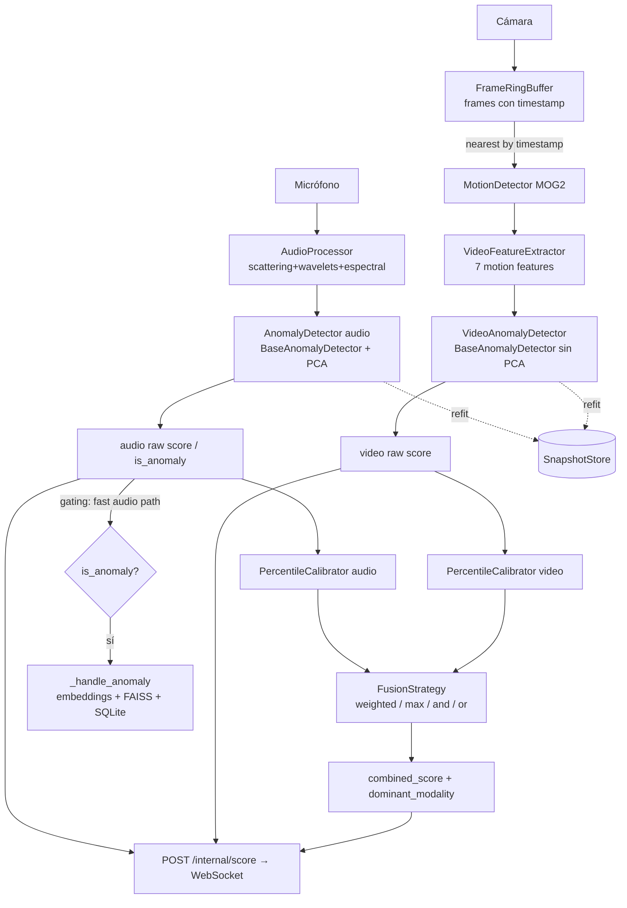

# Arquitectura multimodal (v0.3)

Diagrama del flujo de detección multimodal de fusión tardía. Ver decisiones en
[`../adr/`](../adr/).

## Flujo de detección (proceso pipeline)

## Notas

- **Sincronización temporal:** cada ventana de audio se empareja con el frame
  más cercano en el tiempo vía `FrameRingBuffer.nearest(ts_window)`
  ([ADR-0003](../adr/0003-timestamp-based-av-synchronization.md)).
- **Calibración:** los scores crudos se mapean a percentiles para ser
  comparables antes de fusionar ([ADR-0004](../adr/0004-score-calibration-historical-percentiles.md)).
- **Fusión:** estrategia configurable; el dashboard la recomputa en vivo desde
  los scores por modalidad ([ADR-0005](../adr/0005-configurable-fusion-strategies.md)).
- **Decisión de gating:** sigue la ruta rápida de audio (preservación de
  comportamiento, [ADR-0005](../adr/0005-configurable-fusion-strategies.md));
  promover la fusión a gating es un follow-up.
- **Doble horizonte:** modelos lentos opt-in producen `slow_*` scores
  ([ADR-0007](../adr/0007-dual-horizon-fast-slow-models.md)).
- **Refit/Snapshots/Explicabilidad:** ADR-0008 / 0009 / 0010.
